<!-- =============================== -->
<!-- 🌌 Animated Matrix Background -->
<!-- =============================== -->

<!-- =============================== -->
<!-- 👋 Intro Heading with Titles -->
<!-- =============================== -->

  

<!-- <h1 align="center">Hi I'm Gurveer</h1> -->
<!-- =============================== -->
<!-- 🖊️ Typing Animation Effect -->
<!-- =============================== -->

  

<!-- =============================== -->
<!-- ✨ Divider -->
<!-- =============================== -->
<h3 align="center">
  
</h3>

<!-- =============================== -->
<!-- 👁️ GitHub Profile View Counter -->
<!-- =============================== -->

  

<!-- =============================== -->
<!-- 🖼️ Header Image Banner -->
<!-- =============================== -->

  

<!-- ✨ Divider -->
<h3 align="center">
  
</h3>

<!-- =============================== -->
<!-- 🙋‍♂️ About Section -->
<!-- =============================== -->

<h2 align="left">🚀 About Me</h2>

I'm a Full-Stack Developer with a passion for building scalable web applications and solving complex problems. Currently based in India (UTC +05:30), I specialize in creating efficient, user-friendly solutions that make a difference.

- 🔭 Working on scalable web applications using modern tech stack
- 🌱 Exploring **AWS Cloud Architecture**, **TypeScript**, and **GraphQL**
- 💡 Love tackling competitive programming challenges
- 🎓 IIT Roorkee Graduate '23
- ⚡ Fun fact: I turn coffee into code during my programming marathons!

<!-- ✨ Divider -->
<h3 align="center">
  
</h3>

<!-- =============================== -->
<!-- 🖥️ Interactive Terminal View -->
<!-- =============================== -->
 

  
  

    
See more

      
        

  
GitHub Stats

 

  

<!-- ✨ Divider -->
<h3 align="center">
  
</h3>

<!-- =============================== -->
<!-- 🛠️ Tech Stack Icons -->
<!-- =============================== -->

## 🛠️ Tech Stack

  
  

---

<!-- =============================== -->
<!-- 🎭 Random Dev Joke Generator -->
<!-- =============================== -->

 
  <i>Random Dev Joke for You! 🎭</i>  
  

<!-- ✨ Divider -->
<h3 align="center">
  
</h3>

<!-- =============================== -->
<!-- 📊 GitHub Stats Section -->
<!-- =============================== -->

## 📊 GitHub Stats

  
  
  

---

<!-- =============================== -->
<!-- 🗂️ Summary Cards & Productive Hours -->
<!-- =============================== -->

## 💳 Profile Summary & Productive Time

  
  

<!-- ✨ Divider -->
<h3 align="center">
  
</h3>

<!--  -->

<!-- =============================== -->
<!-- 📌 Pinned GitHub Repositories -->
<!-- =============================== -->

## 🚀 Pinned Projects

  
  

---

<!-- =============================== -->
<!-- 🧠 Inspirational Quote Widget -->
<!-- =============================== -->

## 🧠 Quote to Live By

  

<!-- ✨ Divider -->
<h3 align="center">
  
</h3>

<!-- =============================== -->
<!-- 📅 Contribution Activity Graph -->
<!-- =============================== -->

## 📅 Contribution Graph

---

<!-- =============================== -->
<!-- 🏆 GitHub Trophy Showcase -->
<!-- =============================== -->

## 🏆 GitHub Trophies

  

<!-- ✨ Divider -->
<h3 align="center">
  
</h3>

<!-- =============================== -->
<!-- 🔋 Work Mode Animation Footer -->
<!-- =============================== -->

## 🌀 Working Mode Activated

  

<!-- ✨ Divider -->
<h3 align="center">
  
</h3>

<!-- =============================== -->
<!-- 🔗 Snake Contribution -->
<!-- =============================== -->

## 🐍 Watch My Contributions Come Alive!

> See how my GitHub contributions slither into action!

<!-- ✨ Divider -->
<h3 align="center">
  
</h3>

<!-- =============================== -->
<!-- 🔗 Social & Portfolio Links -->
<!-- =============================== -->

## 🔗 Let’s Connect

  
  
  
  
  
  

---

  <b>💻 Made By ❤️ Gurveer © All Rights Reserved 2025</b>

