# How to Use - Command Reference

This guide explains how to use the scripts and commands in this GitHub profile README project.

## Prerequisites

Before running the commands, make sure you have:

```bash
# Install Node.js dependencies
npm install

# For Python script (optional)
# Python 3.x should be installed
```

## Available Commands

### 1. Generate GitHub Stats SVG

The main command to generate your GitHub statistics as an SVG image:

```bash
node updater.js <username> [theme]
```

**Parameters:**
- `<username>` (required): Your GitHub username
- `[theme]` (optional): Theme name (default: "random")

**Examples:**

```bash
# Generate stats with random theme
node updater.js gurveeer

# Generate stats with specific theme
node updater.js gurveeer dracula

# Generate stats with atom theme
node updater.js gurveeer atom

# Generate stats with github theme
node updater.js gurveeer github
```

**Available Themes:**
- `random` - Randomly selects a theme
- `dracula` - Dracula color scheme
- `atom` - Atom editor theme
- `github` - GitHub color scheme
- `monokai` - Monokai theme
- `hacker` - Matrix/hacker style
- And more (check `src/theme.js` for full list)

**Output:**
- Creates/updates `github_stats.svg` in the project root
- This SVG can be embedded in your README

### 2. Enhance SVG Template

Adds advanced animations and effects to the SVG template:

```bash
python enhance_template.py
```

**What it does:**
- Reads `template.svg`
- Adds animated gradients
- Adds particle effects
- Adds 3D shadows and hover effects
- Creates `template_enhanced.svg`

**Features added:**
- Animated gradient backgrounds
- Glow effects
- Particle system animations
- 3D shadow effects
- Interactive hover states

**Example:**

```bash
# Run the enhancement script
python enhance_template.py

# Output: "Enhanced template created successfully!"
```

## Workflow

### Initial Setup

```bash
# 1. Install dependencies
npm install

# 2. Enhance the template (optional, for advanced effects)
python enhance_template.py

# 3. Generate your stats
node updater.js YOUR_USERNAME

# 4. The github_stats.svg file is now ready to use in your README
```

### Regular Updates

```bash
# Update your stats anytime
node updater.js YOUR_USERNAME

# Try different themes
node updater.js YOUR_USERNAME monokai
node updater.js YOUR_USERNAME hacker
```

### Automation (Optional)

You can automate stats updates using:

**GitHub Actions (recommended):**
Create `.github/workflows/update-stats.yml`:

```yaml
name: Update Stats
on:
  schedule:
    - cron: '0 0 * * *'  # Daily at midnight
  workflow_dispatch:

jobs:
  update:
    runs-on: ubuntu-latest
    steps:
      - uses: actions/checkout@v2
      - uses: actions/setup-node@v2
      - run: npm install
      - run: node updater.js YOUR_USERNAME
      - run: |
          git config user.name github-actions
          git config user.email github-actions@github.com
          git add github_stats.svg
          git commit -m "Update stats" || exit 0
          git push
```

**Cron Job (Linux/Mac):**

```bash
# Edit crontab
crontab -e

# Add this line to update daily at midnight
0 0 * * * cd /path/to/project && node updater.js YOUR_USERNAME
```

**Windows Task Scheduler:**
Create a batch file `update-stats.bat`:

```batch
@echo off
cd C:\path\to\project
node updater.js YOUR_USERNAME
```

Then schedule it in Task Scheduler.

## Troubleshooting

### Command not found

```bash
# Make sure Node.js is installed
node --version

# Make sure Python is installed (for enhance script)
python --version
```

### Missing dependencies

```bash
# Reinstall dependencies
npm install
```

### GitHub API rate limit

If you hit rate limits, the script will fail. Wait an hour or use a GitHub token:

```javascript
// In src/github.js, add authentication
const octokit = new Octokit({
  auth: 'your_github_token'
});
```

### SVG not updating

```bash
# Delete the old SVG and regenerate
del github_stats.svg  # Windows
rm github_stats.svg   # Linux/Mac

node updater.js YOUR_USERNAME
```

## Tips

- Run the updater script regularly to keep stats fresh
- Experiment with different themes to find your favorite
- The enhanced template adds visual flair but increases file size
- Commit the generated SVG to your repository
- Reference the SVG in your README with a relative path

## Example README Integration

```markdown
## My GitHub Stats


```

Or with a direct link:

```markdown

```
